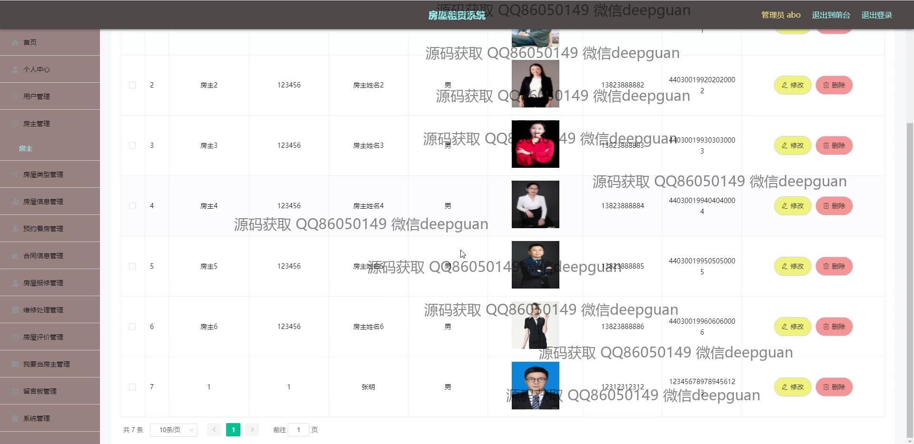
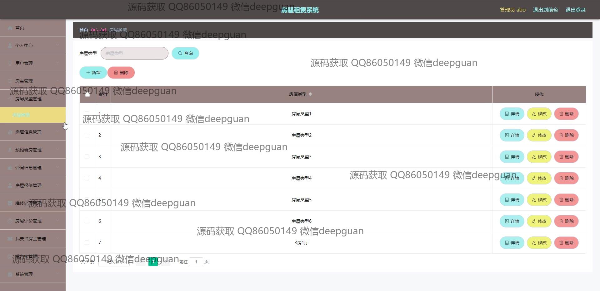
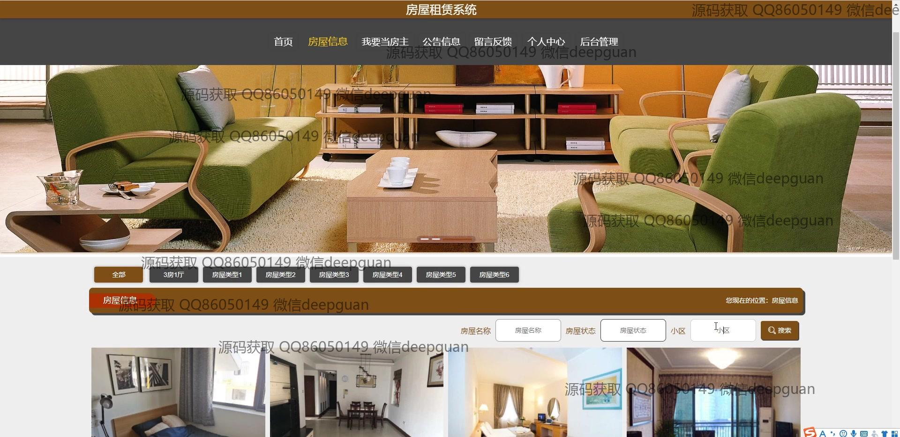
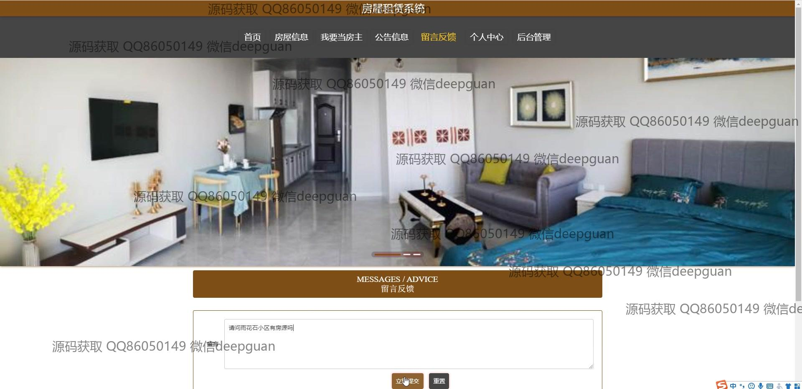
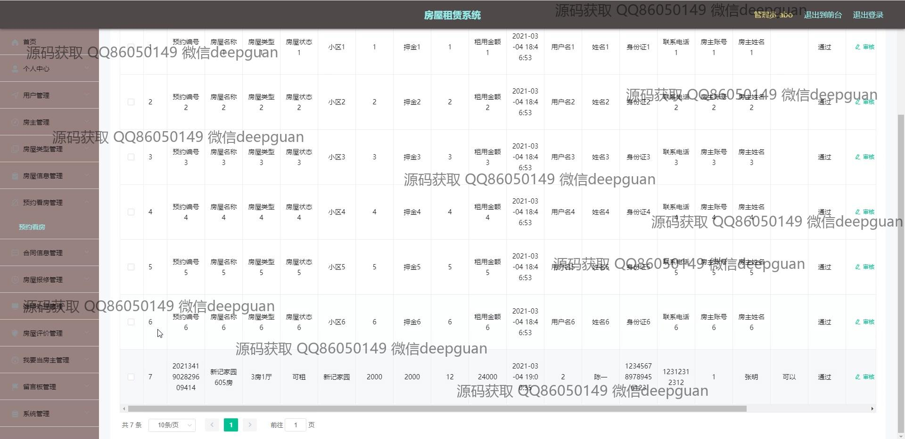

<h1 align="center">房屋租赁系统</h1>

## 简介
房屋租赁系统：角色分为管理员、用户和房主；提供用户管理、房屋管理、合同管理、预约看房、房屋维修和评价管理等功能，支持房源信息编辑、公告发布及用户注册登录，实现全面的租赁业务管理。    --计算机毕业设计源码；毕设源码；java毕业设计源码

## 联系方式

<h3 align="center">获取完整代码与数据库文件 + 微信：deepguan QQ: 86050149 QQ群: 783742310</h3>

<h3 align="center">可帮忙远程部署 包运行成功！提供远程部署、修改代码、设计文档指导、代码讲解等服务！</h3>

## 功能介绍（完整见运行截图）
管理员： 管理员可以通过系统进行用户管理、房主管理和房屋信息管理，支持查看和编辑房主信息、合同信息以及公告信息。此外，管理员能够管理房屋的类型和状态、处理用户的反馈以及审核用户提交的信息。系统还提供了综合管理用户和房产的工具，包括修改和删除操作，以及维护房源展示的功能。管理员可以通过导航菜单快速访问不同的管理模块，确保租赁业务正常运行。

房主： 房主用户通过系统可以更新个人信息，包括姓名、联系方式和身份证信息，并且能够上传头像。房主可以发布和管理自己的房屋信息，输入房屋的详细信息如名称、类型、租赁方式、价格等，并上传房屋图片。同时，房主可以通过系统管理租赁合同和查看房屋的预约和维修请求，确保房屋的有效出租和管理。

普通用户： 普通用户在系统中能够注册账号，登录后可以浏览房屋信息列表，使用搜索和筛选功能查找特定房源。用户可以查看房屋细节，包括租金、位置和设施等，并进行预约看房。系统支持用户发表留言和反馈，用户也能够管理个人信息和查看自己发布的评价。

租客： 租客可以通过系统注册并登录账户，浏览和筛选房源，查看房屋的详细信息和图片。租客能够使用预约功能安排看房，直接联系房主或通过系统提交预约申请。同时，租客还可以查看合同信息，通过系统进行在线咨询，并管理自己的租赁订单和提交房屋的维护请求。

## 运行截图

本代码来源于网络,仅供学习参考使用!

